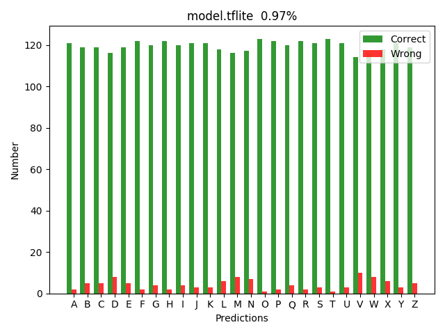
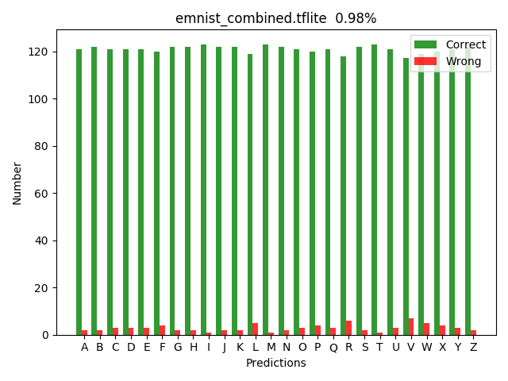
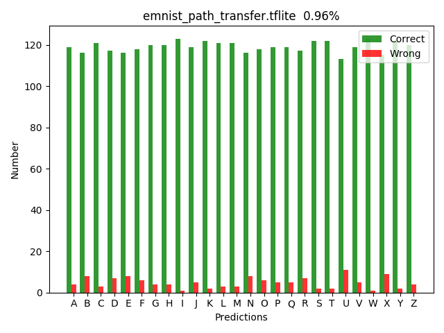

# Observations

**EMNIST Dataset**

**Kaggle A-to-Z dataset**

**Learning with path dataset**

**Combined Path dataset to EMNIST dataseit with ratio 1:2**

**Transfer learning freezing all but last 2 layers from EMNIST, then learning with path dataset**

